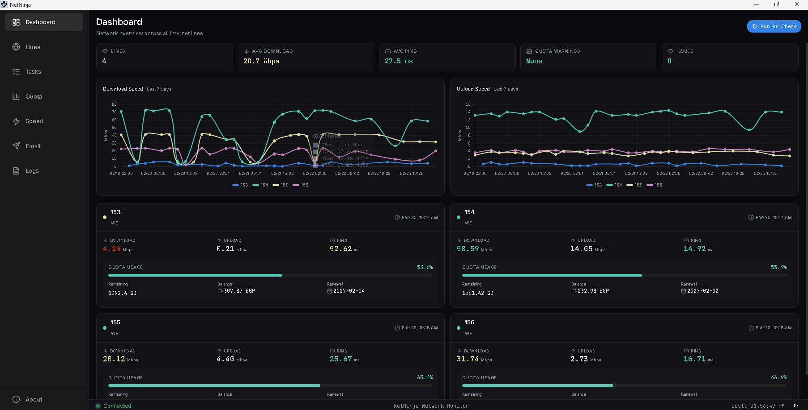
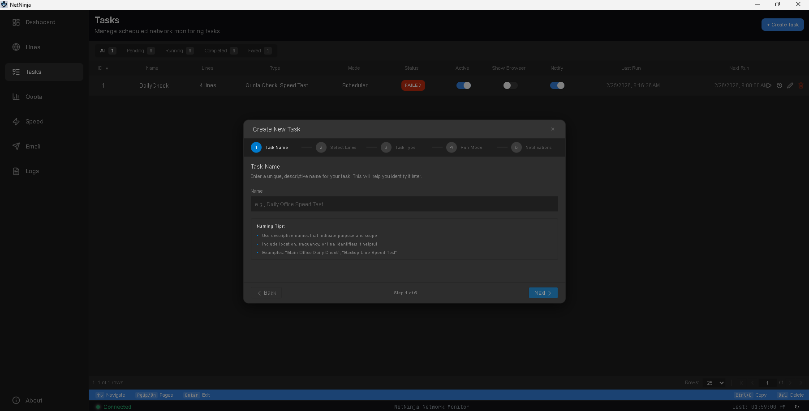
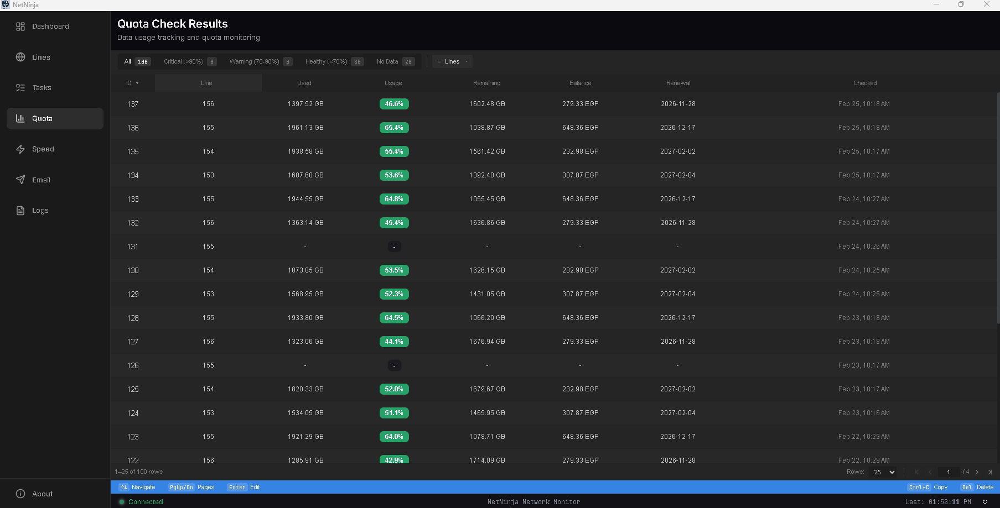
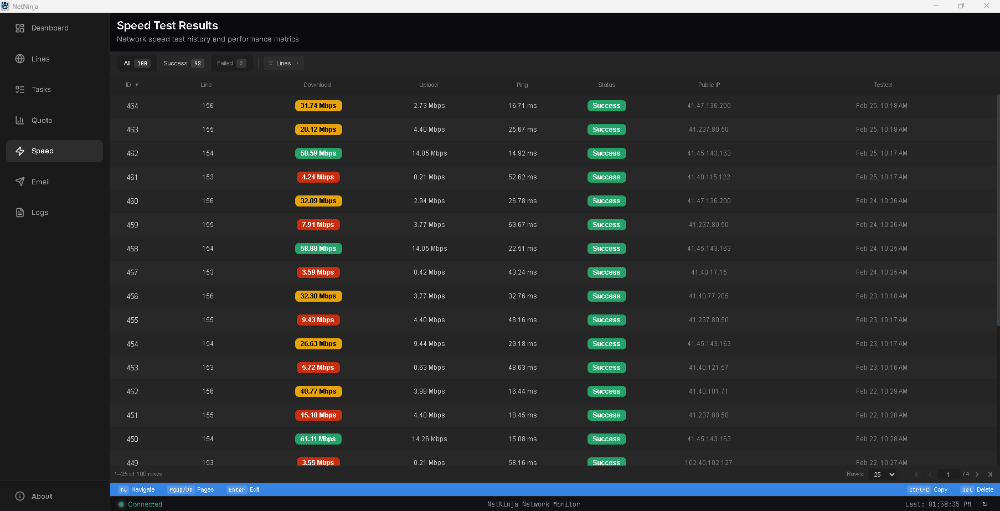

# NetNinja

A network monitoring desktop application built with **Tauri 2** (Rust backend + SolidJS frontend). NetNinja automates quota checking and speed testing across multiple internet lines, scrapes ISP portal data via headless Chrome, stores everything in SQLite, and provides a native desktop UI for configuration and monitoring.

Currently supports Egyptian Internet Service Providers **WE** and **Orange**, authenticating via login credentials to scrape usage data directly from their portals.

## Features

- **Quota Monitoring** -- Automated ISP portal scraping to track data usage per line
- **Speed Testing** -- Network speed tests with source IP binding for multi-WAN setups
- **Task Scheduler** -- Cron-based task scheduling with execution history, timeout handling, and crash recovery
- **Email Notifications** -- Configurable SMTP with per-task notification rules (to/cc recipients, custom subjects)
- **Multi-Line Support** -- Monitor multiple internet connections from a single interface
- **Line-Level Logging** -- Every operation is logged with a process ID and associated line for traceability
- **Desktop-Grade UI** -- Dark-themed native app with sidebar navigation, data tables, charts, and modal workflows
- **Fallback Mode** -- App remains functional for configuration even when the database is unavailable

## Screenshots

| Dashboard | Task Creation Wizard |
|---|---|
|  |  |

| Quota Check Result | Speed Test Result |
|---|---|
|  |  |

## Technology Stack

| Layer | Technology |
|---|---|
| Desktop Runtime | Tauri 2.9 |
| Frontend | SolidJS 1.9, TypeScript 5.9, Tailwind CSS 4, Kobalte UI |
| Build | Vite 7, npm |
| Backend | Rust 2021 edition, Tokio 1.43 |
| Database | SQLite via SQLx 0.8 |
| Browser Automation | chaser-oxide (headless Chrome) |
| Email | lettre 0.11 (SMTP with connection pooling) |
| Scheduler | tokio-cron-scheduler 0.13 |
| Charts | Chart.js 4 |

## Prerequisites

- **Rust** 1.77.2+ with Cargo
- **Node.js** 18+ with **npm**
- Platform build tools for Tauri (see [Tauri prerequisites](https://v2.tauri.app/start/prerequisites/))

## Getting Started

### 1. Clone the repository

```bash
git clone https://github.com/AdelDima/netninja.git
cd netninja
```

### 2. Install frontend dependencies

```bash
cd src/frontend
npm install
```

### 3. Run in development mode

```bash
npm run tauri:dev
```

This starts the Vite dev server and launches the Tauri window. The backend compiles and runs automatically.

### 4. Build for production

```bash
npm run tauri:build
```

Produces platform-specific installers (MSI/NSIS on Windows).

## Project Structure

```
src/
├── frontend/                       # Tauri application (UI)
│   ├── src/
│   │   ├── api/                    # Tauri IPC client & TanStack Query hooks
│   │   ├── components/
│   │   │   ├── charts/             # Chart.js visualisations
│   │   │   ├── desktop-table/      # Reusable data table component
│   │   │   ├── layout/             # AppShell, Sidebar, StatusBar
│   │   │   ├── settings/           # Email & SMTP management
│   │   │   └── ui/                 # Primitives (dialog, toast, button, ...)
│   │   ├── pages/                  # Route-level views
│   │   │   ├── Dashboard.tsx
│   │   │   ├── Lines.tsx           # Internet lines CRUD
│   │   │   ├── Tasks.tsx           # Task management + wizard
│   │   │   ├── QuotaResults.tsx
│   │   │   ├── SpeedResults.tsx
│   │   │   ├── Logs.tsx
│   │   │   ├── EmailSettings.tsx   # SMTP & recipient config
│   │   │   └── About.tsx
│   │   ├── stores/                 # SolidJS reactive stores
│   │   ├── types/                  # Shared TypeScript types
│   │   └── App.tsx                 # Router & providers
│   └── src-tauri/                  # Tauri Rust wrapper
│       └── src/lib.rs              # Command registration
│
└── backend/                        # Rust business logic library
    ├── src/
    │   ├── adapters/tauri/         # Tauri command handlers
    │   ├── services/               # Business logic
    │   ├── repositories/           # SQLite data access
    │   ├── models/                 # Domain models & DTOs
    │   ├── jobs/                   # Background jobs (quota, speed, scheduler)
    │   ├── clients/                # Chrome automation, network diagnostics
    │   ├── config/                 # Settings management
    │   ├── bootstrap/              # App initialisation
    │   ├── crypto/                 # AES-GCM encryption for credentials
    │   ├── db/                     # Pool, migrations, cache
    │   ├── errors/                 # Error types
    │   └── templates/              # Email templates
    └── migrations/                 # SQLite migrations (24 files)
```

## Architecture

### Data Flow

```
SolidJS Component
  → TanStack Query hook (api/queries/)
    → Tauri IPC client (api/client.ts)
      → @tauri-apps/api invoke()
        → src-tauri/lib.rs (command registration)
          → backend/adapters/tauri/*.rs (command handler)
            → backend/services/*.rs (business logic)
              → backend/repositories/*.rs (SQLite queries)
```

### Database

NetNinja uses a single **SQLite** database stored in the OS-specific app data directory (via `platform-dirs`). All settings, lines, results, logs, tasks, and executions live in the same database. Migrations are embedded in the binary and run automatically on startup.

### Task System

Tasks are the primary scheduling unit. Each task:
- Targets one or more internet lines
- Runs on a cron schedule (or manually)
- Executes quota checks and/or speed tests
- Tracks execution history with status, duration, and error messages
- Can send email notifications on completion (configurable per-task)
- Handles timeouts and crash recovery (orphaned executions reset on startup)

### Browser Automation

Quota checking uses **chaser-oxide** to drive a headless Chrome instance, scraping ISP portals with CSS selectors. Chrome is automatically downloaded and managed. Selectors are line-specific and may need updating when ISP portals change.

### Credential Security

ISP login credentials are encrypted at rest using AES-256-GCM. The encryption key is stored separately from the database.

## Development

### Backend only

```bash
cd src/backend
cargo check          # type-check
cargo test           # run tests
cargo build          # build library
```

### Frontend only

```bash
cd src/frontend
npm run dev          # Vite dev server (no Tauri)
npm run build        # TypeScript check + Vite build
```

### Full app

```bash
cd src/frontend
npm run tauri:dev    # launches Tauri with hot-reload
```

### Adding a new Tauri command

When adding a new IPC command, you **must** update three files:

1. **`src/backend/src/adapters/tauri/*.rs`** -- define the `#[tauri::command]` function
2. **`src/backend/src/adapters/tauri/mod.rs`** -- add to `generate_handler![]`
3. **`src/frontend/src-tauri/src/lib.rs`** -- add to `generate_handler![]`

Failure to update both handler lists causes compilation errors.

## Windows Build Notes

The production build (`npm run tauri:build`) compiles a Windows service binary and bundles it into the installer. If you need the service binary for Windows builds:

```bash
cargo build --release --features service --bin netninja-service --manifest-path src/backend/Cargo.toml
```

For Linux/macOS development, `bundle.resources` is set to `{}` so the service binary is not required.

## License

MIT -- see [LICENSE](LICENSE) for details.
